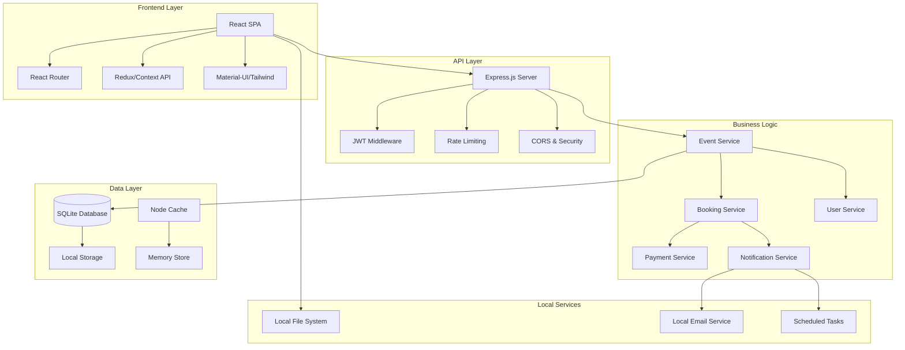
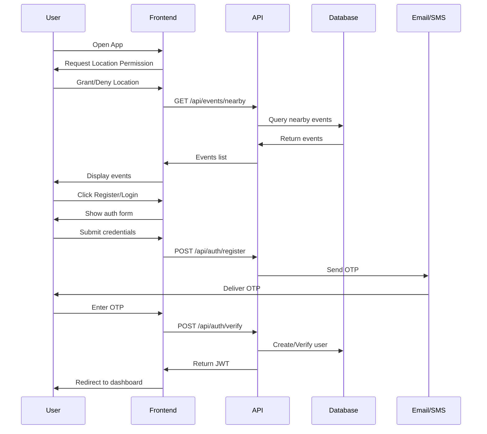
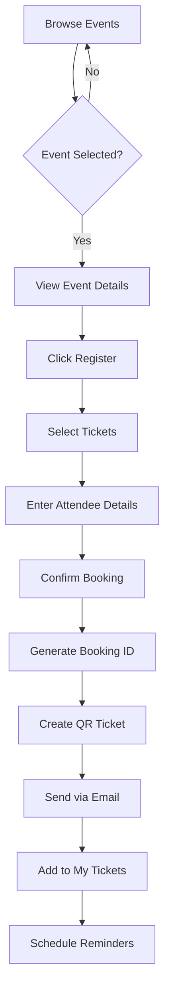
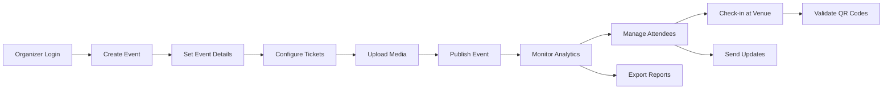
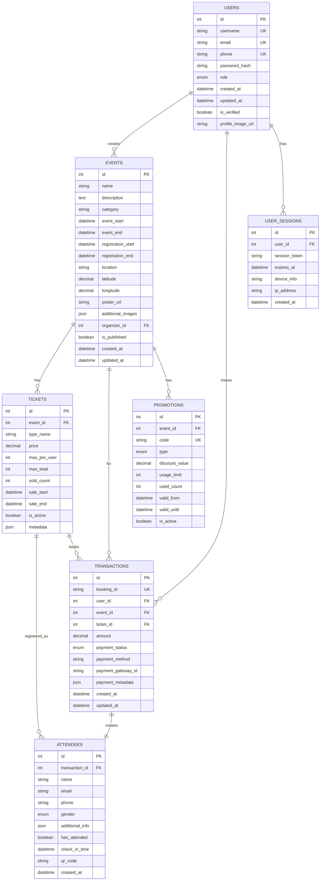

# EventHive – Complete Developer Documentation

<div align="center">


**A Comprehensive Event Management Platform**

[](https://opensource.org/licenses/MIT)
[](https://nodejs.org/)
[](https://reactjs.org/)

</div>

---

## 📋 Table of Contents

- [🎯 Project Overview](#-project-overview)
- [✨ Key Features](#-key-features)
- [🏗️ System Architecture](#️-system-architecture)
- [🔄 Application Flow](#-application-flow)
- [💻 Tech Stack](#-tech-stack)
- [🗄️ Database Design](#️-database-design)
- [🔌 API Documentation](#-api-documentation)
- [🔐 Authentication & Security](#-authentication--security)
- [🚀 Getting Started](#-getting-started)
- [📱 Mobile Responsiveness](#-mobile-responsiveness)
- [🔮 Future Roadmap](#-future-roadmap)

---

## 🎯 Project Overview

EventHive is a **full-stack event management platform** that bridges the gap between event organizers and attendees. It provides a seamless experience for creating, discovering, booking, and managing events with integrated payment processing, automated notifications, and real-time analytics.

### 🎪 Core Value Proposition

- **For Organizers**: Streamlined event creation, ticket management, and attendee analytics
- **For Attendees**: Easy event discovery, secure booking, and convenient ticket delivery
- **For Venues**: QR-based check-in system with real-time validation

---

## ✨ Key Features

### 👥 For Attendees

| Feature | Description | Status |
|---------|-------------|--------|
| **Event Discovery** | Location-based search with advanced filters | ✅ Core |
| **Secure Booking** | Multi-step booking wizard with payment integration | ✅ Core |
| **Digital Tickets** | QR/Barcode tickets delivered via Email/WhatsApp | ✅ Core |
| **Smart Reminders** | Automated notifications 24h & 1h before events | ✅ Core |
| **Loyalty System** | Points and referral rewards | 🔄 Phase 2 |
| **Social Integration** | Share events on social media platforms | 🔄 Phase 2 |

### 🎯 For Organizers

| Feature | Description | Status |
|---------|-------------|--------|
| **Event Management** | Create, edit, and publish events with rich media | ✅ Core |
| **Ticket Configuration** | Multiple ticket types with pricing and limits | ✅ Core |
| **Real-time Analytics** | Sales tracking, demographics, and revenue reports | ✅ Core |
| **Attendee Management** | Searchable attendee lists with export functionality | ✅ Core |
| **Promotion Tools** | Discount codes, early bird pricing, group offers | 🔄 Phase 2 |
| **Team Management** | Role-based access for admins, managers, volunteers | 🔄 Phase 2 |

### 🔧 System Features

- **Local-first Architecture** with role-based access control
- **Real-time Updates** using WebSocket connections
- **Local File Storage** for images and documents
- **Automated Email** notifications and reminders (local SMTP)
- **QR Code Validation** system for secure check-ins
- **Comprehensive Logging** and error tracking

---

## 🏗️ System Architecture



---

## 🔄 Application Flow

### 🚀 User Onboarding & Authentication



### 🎫 Event Booking Process



### 🏢 Organizer Workflow



---

## 💻 Tech Stack

### 🎨 Frontend Stack

| Technology | Version | Purpose | Documentation |
|------------|---------|---------|---------------|
| **React** | ^18.2.0 | UI Library | [React Docs](https://reactjs.org/docs) |
| **React Router** | ^6.8.0 | Client-side routing | [Router Docs](https://reactrouter.com/) |
| **Redux Toolkit** | ^1.9.0 | State management | [Redux Docs](https://redux-toolkit.js.org/) |
| **Material-UI** | ^5.11.0 | UI Components | [MUI Docs](https://mui.com/) |
| **Axios** | ^1.3.0 | HTTP Client | [Axios Docs](https://axios-http.com/) |
| **React Query** | ^4.24.0 | Server state management | [TanStack Query](https://tanstack.com/query/) |

### ⚙️ Backend Stack

| Technology | Version | Purpose | Documentation |
|------------|---------|---------|---------------|
| **Node.js** | ^18.0.0 | Runtime environment | [Node.js Docs](https://nodejs.org/docs/) |
| **Express.js** | ^4.18.0 | Web framework | [Express Docs](https://expressjs.com/) |
| **SQLite** | ^3.40.0 | Local database | [SQLite Docs](https://sqlite.org/docs.html) |
| **node-cache** | ^5.1.0 | In-memory caching | [node-cache Docs](https://github.com/node-cache/node-cache) |
| **JWT** | ^9.0.0 | Authentication | [JWT.io](https://jwt.io/) |
| **Multer** | ^1.4.0 | File uploads | [Multer Docs](https://github.com/expressjs/multer) |

### 🔌 Local Storage & Services

| Service | Purpose | Documentation |
|---------|---------|---------------|
| **Local File System** | File storage (images, documents) | [Node.js fs](https://nodejs.org/api/fs.html) |
| **Nodemailer** | Email delivery (local SMTP) | [Nodemailer Docs](https://nodemailer.com/) |
| **node-cron** | Scheduled tasks & reminders | [node-cron Docs](https://github.com/node-cron/node-cron) |

---

## 🗄️ Database Design

### 📊 Entity Relationship Diagram



### 📝 Table Specifications

#### Users Table
```sql
CREATE TABLE users (
    id INTEGER PRIMARY KEY AUTOINCREMENT,
    username TEXT UNIQUE NOT NULL,
    email TEXT UNIQUE NOT NULL,
    phone TEXT UNIQUE NOT NULL,
    password_hash TEXT NOT NULL,
    role TEXT DEFAULT 'user' CHECK(role IN ('user', 'organizer', 'admin')),
    is_verified INTEGER DEFAULT 0,
    profile_image_url TEXT,
    created_at DATETIME DEFAULT CURRENT_TIMESTAMP,
    updated_at DATETIME DEFAULT CURRENT_TIMESTAMP
);

CREATE INDEX idx_users_email ON users(email);
CREATE INDEX idx_users_phone ON users(phone);
CREATE INDEX idx_users_role ON users(role);
```

#### Events Table
```sql
CREATE TABLE events (
    id INTEGER PRIMARY KEY AUTOINCREMENT,
    name TEXT NOT NULL,
    description TEXT,
    category TEXT NOT NULL,
    event_start DATETIME NOT NULL,
    event_end DATETIME NOT NULL,
    registration_start DATETIME NOT NULL,
    registration_end DATETIME NOT NULL,
    location TEXT NOT NULL,
    latitude REAL,
    longitude REAL,
    poster_url TEXT,
    additional_images TEXT, -- JSON stored as TEXT
    organizer_id INTEGER NOT NULL,
    is_published INTEGER DEFAULT 0,
    created_at DATETIME DEFAULT CURRENT_TIMESTAMP,
    updated_at DATETIME DEFAULT CURRENT_TIMESTAMP,
    
    FOREIGN KEY (organizer_id) REFERENCES users(id) ON DELETE CASCADE
);

CREATE INDEX idx_events_category ON events(category);
CREATE INDEX idx_events_start ON events(event_start);
CREATE INDEX idx_events_location ON events(latitude, longitude);
CREATE INDEX idx_events_organizer ON events(organizer_id);
```

#### Tickets Table
```sql
CREATE TABLE tickets (
    id INTEGER PRIMARY KEY AUTOINCREMENT,
    event_id INTEGER NOT NULL,
    type_name TEXT NOT NULL,
    price REAL NOT NULL,
    max_per_user INTEGER,
    max_total INTEGER,
    sold_count INTEGER DEFAULT 0,
    sale_start DATETIME,
    sale_end DATETIME,
    is_active INTEGER DEFAULT 1,
    metadata TEXT, -- JSON stored as TEXT
    
    FOREIGN KEY (event_id) REFERENCES events(id) ON DELETE CASCADE
);
```

#### Attendees Table
```sql
CREATE TABLE attendees (
    id INTEGER PRIMARY KEY AUTOINCREMENT,
    transaction_id INTEGER NOT NULL,
    name TEXT NOT NULL,
    email TEXT NOT NULL,
    phone TEXT,
    gender TEXT CHECK(gender IN ('male', 'female', 'other')),
    additional_info TEXT, -- JSON stored as TEXT
    has_attended INTEGER DEFAULT 0,
    check_in_time DATETIME,
    qr_code TEXT UNIQUE,
    created_at DATETIME DEFAULT CURRENT_TIMESTAMP,
    
    FOREIGN KEY (transaction_id) REFERENCES transactions(id) ON DELETE CASCADE
);
```

#### Transactions Table
```sql
CREATE TABLE transactions (
    id INTEGER PRIMARY KEY AUTOINCREMENT,
    booking_id TEXT UNIQUE NOT NULL,
    user_id INTEGER NOT NULL,
    event_id INTEGER NOT NULL,
    ticket_id INTEGER NOT NULL,
    amount REAL NOT NULL,
    payment_status TEXT DEFAULT 'completed' CHECK(payment_status IN ('pending', 'completed', 'failed', 'refunded')),
    payment_method TEXT DEFAULT 'free',
    created_at DATETIME DEFAULT CURRENT_TIMESTAMP,
    updated_at DATETIME DEFAULT CURRENT_TIMESTAMP,
    
    FOREIGN KEY (user_id) REFERENCES users(id) ON DELETE CASCADE,
    FOREIGN KEY (event_id) REFERENCES events(id) ON DELETE CASCADE,
    FOREIGN KEY (ticket_id) REFERENCES tickets(id) ON DELETE CASCADE
);
```

---

## 🔌 API Documentation

### 🔐 Authentication Endpoints

#### Register User
```http
POST /api/auth/register
Content-Type: application/json

{
  "username": "john_doe",
  "email": "john@example.com",
  "phone": "+1234567890",
  "password": "securePassword123",
  "role": "user"
}
```

**Response:**
```json
{
  "success": true,
  "message": "OTP sent to email and phone",
  "data": {
    "userId": 123,
    "otpSent": true
  }
}
```

#### Verify OTP
```http
POST /api/auth/verify-otp
Content-Type: application/json

{
  "userId": 123,
  "otp": "123456",
  "type": "registration"
}
```

**Response:**
```json
{
  "success": true,
  "message": "Account verified successfully",
  "data": {
    "token": "eyJhbGciOiJIUzI1NiIsInR5cCI6IkpXVCJ9...",
    "user": {
      "id": 123,
      "username": "john_doe",
      "email": "john@example.com",
      "role": "user"
    }
  }
}
```

### 🎪 Event Management Endpoints

#### Get Events
```http
GET /api/events?category=music&location=new-york&page=1&limit=10
```

**Response:**
```json
{
  "success": true,
  "data": {
    "events": [
      {
        "id": 1,
        "name": "Summer Music Festival",
        "description": "Amazing outdoor music festival",
        "category": "music",
        "eventStart": "2024-07-15T18:00:00Z",
        "eventEnd": "2024-07-15T23:00:00Z",
        "location": "Central Park, New York",
        "posterUrl": "https://example.com/poster.jpg",
        "organizer": {
          "id": 456,
          "username": "event_organizer"
        },
        "ticketTypes": [
          {
            "id": 1,
            "typeName": "General Admission",
            "price": 50.00,
            "available": 450
          }
        ]
      }
    ],
    "pagination": {
      "currentPage": 1,
      "totalPages": 5,
      "totalEvents": 48
    }
  }
}
```

#### Create Event
```http
POST /api/events
Authorization: Bearer <jwt_token>
Content-Type: application/json

{
  "name": "Tech Conference 2024",
  "description": "Annual technology conference",
  "category": "technology",
  "eventStart": "2024-08-20T09:00:00Z",
  "eventEnd": "2024-08-20T18:00:00Z",
  "registrationStart": "2024-06-01T00:00:00Z",
  "registrationEnd": "2024-08-15T23:59:59Z",
  "location": "Convention Center, San Francisco",
  "latitude": 37.7749,
  "longitude": -122.4194,
     "ticketTypes": [
     {
       "typeName": "General Admission",
       "price": 0.00,
       "maxPerUser": 4,
       "maxTotal": 200,
       "saleStart": "2024-06-01T00:00:00Z",
       "saleEnd": "2024-08-15T23:59:59Z"
     },
     {
       "typeName": "VIP Access",
       "price": 0.00,
       "maxPerUser": 2,
       "maxTotal": 50,
       "saleStart": "2024-06-01T00:00:00Z",
       "saleEnd": "2024-08-15T23:59:59Z"
     }
   ]
}
```

### 🎫 Booking Endpoints

#### Create Booking
```http
POST /api/bookings
Authorization: Bearer <jwt_token>
Content-Type: application/json

{
  "eventId": 1,
  "ticketId": 1,
  "quantity": 2,
  "attendees": [
    {
      "name": "John Doe",
      "email": "john@example.com",
      "phone": "+1234567890",
      "gender": "male"
    },
    {
      "name": "Jane Smith",
      "email": "jane@example.com",
      "phone": "+1234567891",
      "gender": "female"
    }
  ]
}
```

**Response:**
```json
{
  "success": true,
  "message": "Booking created successfully",
  "data": {
    "bookingId": "EVT-2024-001234",
    "transactionId": 789,
    "amount": 0.00,
    "paymentStatus": "completed",
    "attendees": [
      {
        "id": 101,
        "name": "John Doe",
        "qrCode": "QR123456789"
      },
      {
        "id": 102,
        "name": "Jane Smith",
        "qrCode": "QR123456790"
      }
    ]
  }
}
```

#### Get User Bookings
```http
GET /api/bookings/me
Authorization: Bearer <jwt_token>
```

**Response:**
```json
{
  "success": true,
  "data": {
    "bookings": [
      {
        "bookingId": "EVT-2024-001234",
        "event": {
          "id": 1,
          "name": "Summer Music Festival",
          "eventStart": "2024-07-15T18:00:00Z",
          "location": "Central Park, New York"
        },
        "attendees": [
          {
            "name": "John Doe",
            "qrCode": "QR123456789",
            "hasAttended": false
          }
        ],
        "amount": 0.00,
        "status": "completed",
        "createdAt": "2024-06-01T10:30:00Z"
      }
    ]
  }
}
```

### 📊 Analytics Endpoints

#### Get Event Analytics
```http
GET /api/events/1/analytics
Authorization: Bearer <jwt_token>
```

**Response:**
```json
{
  "success": true,
  "data": {
    "overview": {
      "totalTicketsSold": 245,
      "totalRevenue": 12250.00,
      "totalAttendees": 245,
      "checkedInCount": 198
    },
    "ticketBreakdown": [
      {
        "typeName": "Early Bird",
        "sold": 95,
        "revenue": 18905.05,
        "available": 5
      },
      {
        "typeName": "Regular",
        "sold": 150,
        "revenue": 44999.50,
        "available": 350
      }
    ],
    "demographics": {
      "gender": {
        "male": 132,
        "female": 108,
        "other": 5
      },
      "ageGroups": {
        "18-25": 89,
        "26-35": 112,
        "36-45": 34,
        "46+": 10
      }
    },
    "salesOverTime": [
      {
        "date": "2024-06-01",
        "tickets": 25,
        "revenue": 4975.75
      }
    ]
  }
}
```

---

## 🔐 Authentication & Security

### 🛡️ Security Measures

| Layer | Implementation | Description |
|-------|----------------|-------------|
| **Authentication** | JWT + OTP | Multi-factor authentication with time-limited tokens |
| **Authorization** | RBAC | Role-based access control for different user types |
| **Data Encryption** | bcrypt + HTTPS | Password hashing and encrypted data transmission |
| **Input Validation** | Joi/Yup | Comprehensive input sanitization and validation |
| **Rate Limiting** | Express-rate-limit | API endpoint protection against abuse |
| **CORS** | Configured origins | Cross-origin resource sharing restrictions |
| **SQL Injection** | Parameterized queries | Protection against database attacks |
| **XSS Protection** | Content Security Policy | Cross-site scripting prevention |

### 🔑 JWT Token Structure

```javascript
// JWT Payload
{
  "userId": 123,
  "username": "john_doe",
  "email": "john@example.com",
  "role": "user",
  "iat": 1640995200,
  "exp": 1641081600,
  "jti": "unique-token-id"
}
```

### 🚨 Error Handling

```javascript
// Standard Error Response Format
{
  "success": false,
  "error": {
    "code": "VALIDATION_ERROR",
    "message": "Invalid input data",
    "details": [
      {
        "field": "email",
        "message": "Valid email is required"
      }
    ]
  },
  "timestamp": "2024-01-15T10:30:00Z",
  "requestId": "req-123456789"
}
```

---

## 🚀 Getting Started

### 📋 Prerequisites

- **Node.js** (v18.0.0 or higher)
- **npm** or **yarn** package manager
- **SQLite3** (comes with Node.js sqlite3 package)
- **Git** for version control

### ⚡ Quick Setup

1. **Clone the repository**
   ```bash
   git clone https://github.com/your-username/eventhive.git
   cd eventhive
   ```

2. **Install dependencies**
   ```bash
   # Backend dependencies
   cd backend
   npm install
   
   # Frontend dependencies
   cd ../frontend
   npm install
   ```

3. **Environment Configuration**
   ```bash
   # Backend environment (.env)
   cp .env.example .env
   ```

   ```env
   # Application Configuration
   NODE_ENV=development
   PORT=5000
   
   # Database Configuration (SQLite)
   DB_PATH=./data/eventhive.db
   
   # JWT Configuration
   JWT_SECRET=your-super-secret-jwt-key-change-this-in-production
   JWT_EXPIRE=24h
   
   # Local File Storage
   UPLOAD_PATH=./uploads
   MAX_FILE_SIZE=5242880
   
   # Email Configuration (Local SMTP)
   EMAIL_HOST=localhost
   EMAIL_PORT=587
   EMAIL_USER=your_email@example.com
   EMAIL_PASS=your_email_password
   EMAIL_FROM=EventHive <noreply@eventhive.local>
   
   # Application URLs
   CLIENT_URL=http://localhost:3000
   SERVER_URL=http://localhost:5000
   ```

4. **Database Setup**
   ```bash
   # Create data directory
   cd backend
   mkdir -p data uploads
   
   # Initialize SQLite database
   npm run db:init
   
   # Run migrations to create tables
   npm run db:migrate
   
   # Seed sample data (optional)
   npm run db:seed
   ```

5. **Start Development Servers**
   ```bash
   # Start backend (Terminal 1)
   cd backend
   npm run dev
   
   # Start frontend (Terminal 2)
   cd frontend
   npm start
   ```

6. **Access the Application**
   - Frontend: http://localhost:3000
   - Backend API: http://localhost:5000
   - API Documentation: http://localhost:5000/api-docs

### 🐳 Docker Setup (Optional)

```yaml
# docker-compose.yml
version: '3.8'
services:
  backend:
    build: ./backend
    ports:
      - "5000:5000"
    volumes:
      - ./backend/data:/app/data
      - ./backend/uploads:/app/uploads
    environment:
      - NODE_ENV=development
      - DB_PATH=/app/data/eventhive.db
      - UPLOAD_PATH=/app/uploads

  frontend:
    build: ./frontend
    ports:
      - "3000:3000"
    depends_on:
      - backend
    environment:
      - REACT_APP_API_URL=http://localhost:5000
```

```bash
# Start with Docker
docker-compose up -d
```

### 📁 Project Structure

```
eventhive/
├── backend/
│   ├── data/                 # SQLite database files
│   │   └── eventhive.db
│   ├── uploads/              # User uploaded files
│   │   ├── events/           # Event posters and images
│   │   └── profiles/         # User profile images
│   ├── src/
│   │   ├── config/           # Database and app configuration
│   │   ├── controllers/      # Route controllers
│   │   ├── middleware/       # Custom middleware
│   │   ├── models/           # Database models
│   │   ├── routes/           # API routes
│   │   ├── services/         # Business logic
│   │   └── utils/            # Helper utilities
│   ├── migrations/           # Database migrations
│   └── package.json
├── frontend/
│   ├── public/
│   ├── src/
│   │   ├── components/       # React components
│   │   ├── pages/            # Page components
│   │   ├── hooks/            # Custom hooks
│   │   ├── services/         # API services
│   │   ├── store/            # Redux store
│   │   └── utils/            # Helper utilities
│   └── package.json
└── README.md
```

---

## 📱 Mobile Responsiveness

### 📐 Responsive Design Breakpoints

```css
/* Mobile First Approach */
:root {
  --mobile: 320px;
  --tablet: 768px;
  --desktop: 1024px;
  --large-desktop: 1440px;
}

@media (min-width: 768px) {
  /* Tablet styles */
}

@media (min-width: 1024px) {
  /* Desktop styles */
}
```

### 📱 PWA Features

- **Offline Support** with Service Workers
- **Push Notifications** for event reminders
- **Add to Home Screen** functionality
- **Background Sync** for failed requests
- **Responsive Images** with lazy loading

---

## 🔮 Future Roadmap

### 📅 Phase 2 (Q2 2024)
- [ ] **Advanced Analytics Dashboard**
- [ ] **Multi-language Support** (i18n)
- [ ] **Social Media Integration**
- [ ] **Advanced Promotion System**
- [ ] **Team Management Features**

### 📅 Phase 3 (Q3 2024)
- [ ] **Mobile Applications** (iOS & Android)
- [ ] **AI-powered Recommendations**
- [ ] **Live Streaming Integration**
- [ ] **Blockchain Ticket Verification**
- [ ] **Advanced Reporting & Insights**

### 📅 Phase 4 (Q4 2024)
- [ ] **White-label Solutions**
- [ ] **API Marketplace**
- [ ] **Advanced Security Features**
- [ ] **Machine Learning Analytics**
- [ ] **Global Payment Methods**

---

## 📚 Additional Resources

### 🔗 Important Links
- [API Documentation](http://localhost:5000/api-docs)
- [Contributing Guidelines](CONTRIBUTING.md)
- [Code of Conduct](CODE_OF_CONDUCT.md)
- [License](LICENSE)

### 🆘 Support
- **Email**: support@eventhive.com
- **Discord**: [EventHive Community](https://discord.gg/eventhive)
- **GitHub Issues**: [Report Bugs](https://github.com/your-username/eventhive/issues)

### 👥 Contributing
We welcome contributions! Please read our [Contributing Guidelines](CONTRIBUTING.md) before submitting pull requests.

---

<div align="center">

**Built with ❤️ by the EventHive Team**

[🌟 Star us on GitHub](https://github.com/your-username/eventhive) | [🐛 Report Issues](https://github.com/your-username/eventhive/issues) | [📖 Documentation](https://docs.eventhive.com)

</div>
